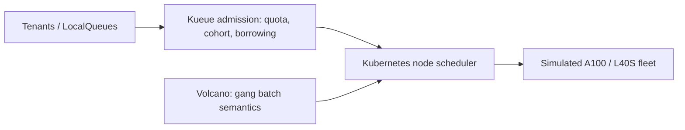

# GPU Scheduler Lab

A local, reproducible laboratory for shared AI accelerator scheduling: quotas, borrowing, fair-share analysis, priorities, gang admission, flavors and fragmentation. Local GPU units are **SIMULATED RESOURCE CAPACITY**; this repository makes no CUDA, GPU-utilization, NVLink, RDMA, or performance claim.



Kueue answers whether work may be admitted; Kubernetes chooses a node for admitted Pods; Volcano is reserved for gang/HPC experiments. The initial executable core is an offline policy simulator; Kubernetes/Kueue/Volcano behavior must be run and recorded separately.

```bash
python -m pip install -e '.[dev]'
make test lint
make demo-borrow
```

See [roadmap](docs/roadmap.md) and [Kueue vs Volcano](docs/kueue-vs-volcano.md).
