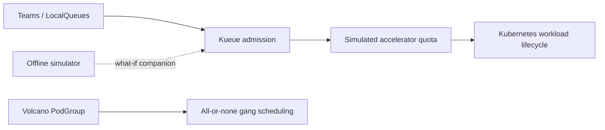

# GPU Scheduler Lab

A local-first, reproducible laboratory for operating shared AI accelerator capacity on Kubernetes. It demonstrates **real Kueue admission control** and **real Volcano gang scheduling** in kind while deliberately using `example.com/simulated-gpu` as a Kueue-only accounting resource.

> **Hardware boundary:** no physical GPU, CUDA, MIG, NVLink, RDMA, accelerator utilisation, or model-performance claim is made. Kueue quota quantities named `simulated-gpu` represent policy capacity only. Volcano’s gang test uses ordinary CPU requests to prove scheduler semantics.

## Why this exists

Shared AI compute creates a platform question: when capacity is scarce, who is admitted, who may borrow unused quota, what happens when production work arrives, and how do distributed training workloads avoid starting only half their workers?



Kueue decides whether work receives quota; Kubernetes/Volcano schedule Pods. The Python simulator remains useful for policy exploration, but it is not evidence of Kubernetes scheduler behavior.

## What has been executed locally

- kind Kubernetes cluster with Kueue `v0.19.6` and Volcano `v1.12.0`.
- ResourceFlavor, cohort-linked ClusterQueues, and tenant LocalQueues.
- Quota admission, quota exhaustion, borrowing, and admission after released quota.
- Kueue fair-sharing weighted-share status using configured queue weights.
- Cohort reclaim: a higher-priority inference workload preempts a low-priority borrower.
- BestEffortFIFO starvation avoidance: an impossible earlier workload stays pending while a later fitting workload is admitted.
- Volcano PodGroup gang success and failure: two satisfiable Pods schedule; both members of an impossible gang remain pending.

See [implementation status](docs/IMPLEMENTATION_STATUS.md) and [validation evidence](docs/VALIDATION.md) for exact boundaries.

## Quick start

Prerequisites: Docker Desktop, `kind`, `kubectl`, `curl`, Bash, and Python 3.12+.

```bash
make install
make bootstrap-local
make smoke
make demo-kueue
make demo-fair-share
make demo-preemption
make demo-starvation
make demo-gang
make dashboard
make verify
make clean-local
```

`make clean-local` deletes only the `gpu-scheduler-lab` kind cluster and this repository’s `.local` directory. It does not prune Docker globally or delete unrelated clusters, containers, volumes, or images.

## Experiments

| Command | Evidence produced |
| --- | --- |
| `make demo-kueue` | Borrowed quota, quota exhaustion, release, then admission |
| `make demo-fair-share` | Configured Kueue weighted-share state for the two queues |
| `make demo-preemption` | Low-priority borrower receives a Kueue `Preempted` condition; protected work admits |
| `make demo-starvation` | Impossible early workload remains pending; later fitting workload admits |
| `make demo-gang` | Real Volcano scheduler starts both feasible gang members and retains infeasible members pending |
| `make dashboard` | Starts a read-only live dashboard at `http://127.0.0.1:18081` from real Kubernetes API state |
| `make dashboard-stop` | Stops only the project dashboard process |
| `make cleanroom-validate` | Two project-scoped clean bootstrap/demo/cleanup cycles |

## Architecture choices

- **Kueue** controls admission, quotas, borrowing, fair sharing, and preemption.
- **Volcano** proves PodGroup gang behavior separately from Kueue.
- **kind** is the disposable local Kubernetes environment.
- **Synthetic accelerator resource** is intentionally not attached to a node; it proves control-plane admission policy, not physical placement.

See [Kueue versus Volcano](docs/kueue-vs-volcano.md) and [roadmap](docs/roadmap.md).

## Live scheduler dashboard

After `make bootstrap-local`, run `make dashboard` and open
[`http://127.0.0.1:18081`](http://127.0.0.1:18081). The page refreshes from the
project-scoped kind cluster every five seconds and shows real Kueue queues and
workloads plus Volcano PodGroups and gang-member Pod phases. Run `make demo-kueue`
or `make demo-gang` before taking a screenshot. It is intentionally read-only;
the prominent simulated-hardware boundary remains visible in the UI.
